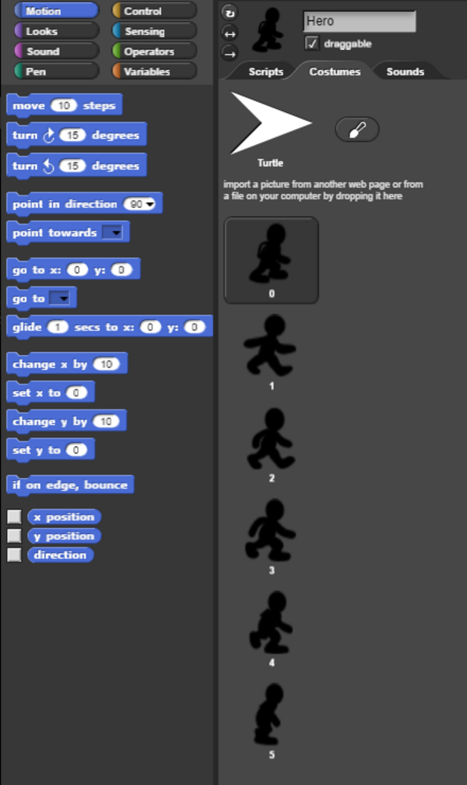
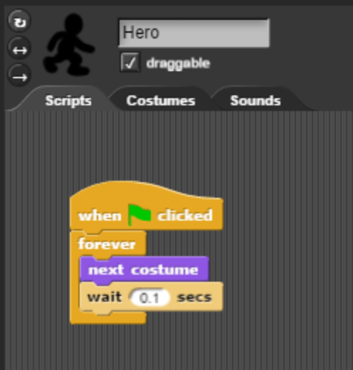
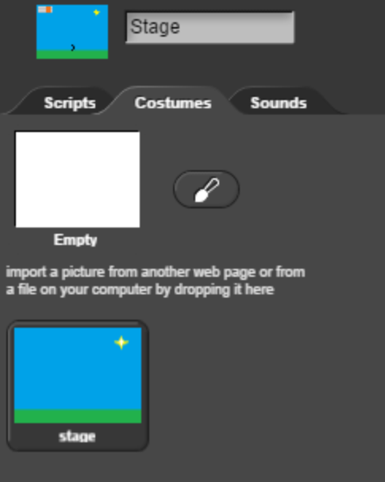
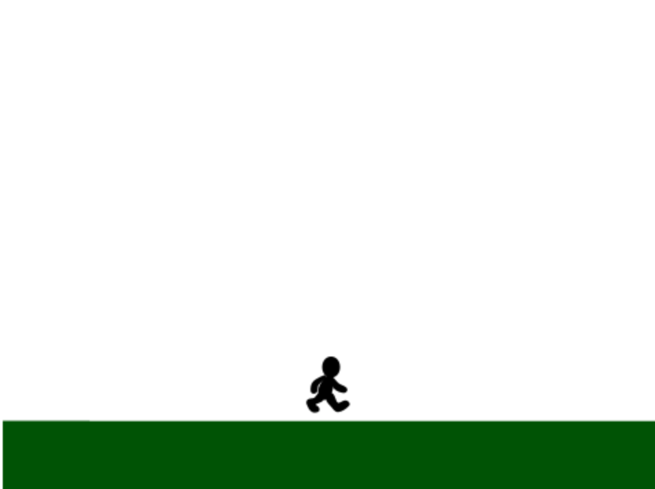
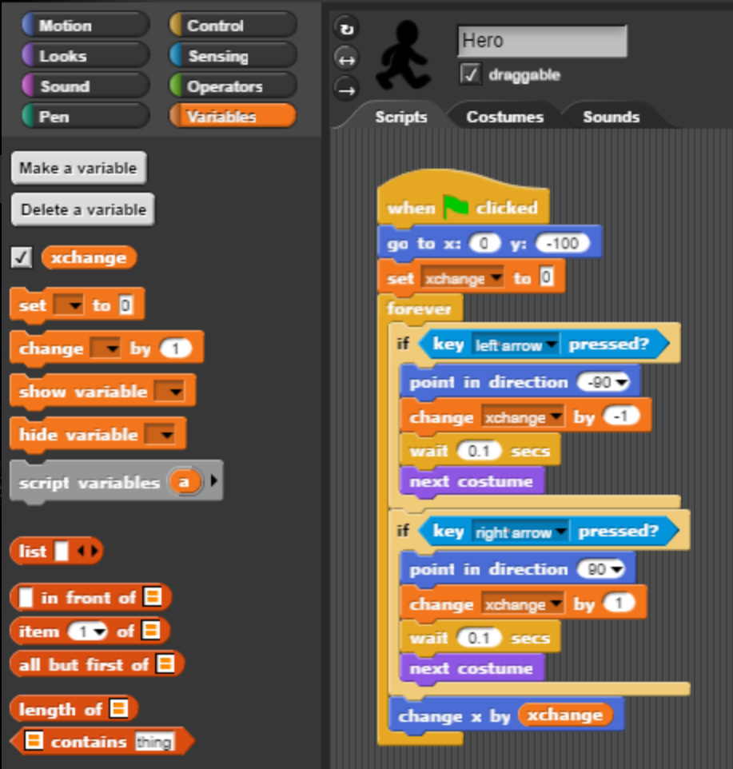
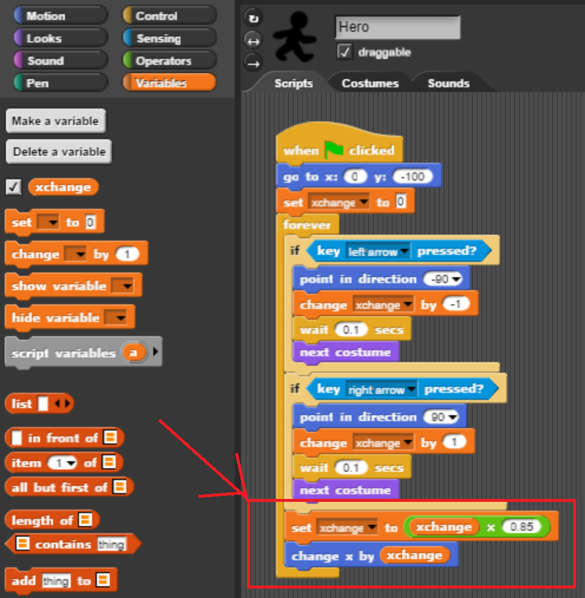
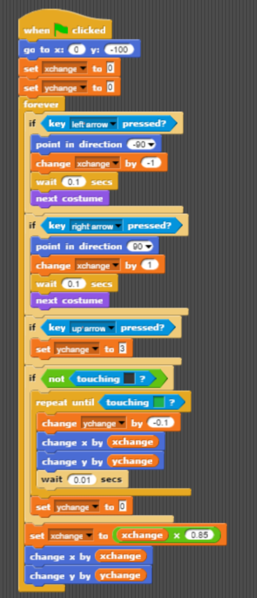
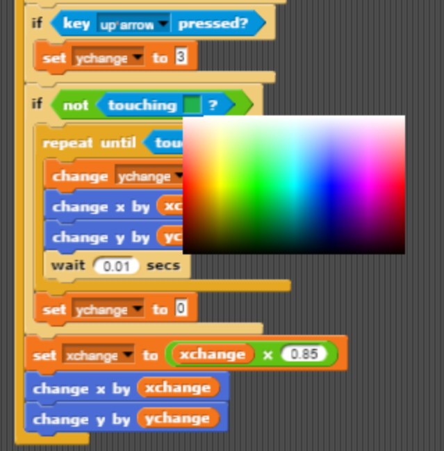

# How to Build a Platform Game in Snap

By Larry K

## What is a Platform Game?

A platform game  consists of a player-controlled **Hero** who completes a series of **levels** or **missions**. Each level has an **objective** or **goal** that must be achieved in order to complete the level. It is called a platform game because the player jumps on **platforms** and dodges various **enemies**. Platform games also typically have a number of **powerups** that make the Hero more powerful. 

One of the most famous platform games is Super Mario Brothers. In Mario Brothers, the Hero is Mario. Mario completes a level by touching the flag or defeating Bowser. Enemies in Mario Brothers include Goombas, Koopa Troopas, and Thwomps, who each attack Mario in various ways. Mario can grab a number of **powerups** to become mower powerful. Examples of powerups in Mario Brothers include Mushrooms, Stars, and Flower Power. 

Other examples of platform games include Sonic the Hedgehog, Metroid, and many others. In Metroid, the hero is Samus Aran. Examples of powerups in Metroid include the Ice Beam (freezes enemies), High Jump Boots (makes Samus jump higher), and Missile Packs (more powerful attacks). 

Your first task will be to design your own platform game nd

## The Hero

We will start off our platform game by creating a Hero sprite. The Hero is controlled the person playing the gamet. In Super Mario Brothers, the Hero is Mario. In Metroid, the Hero is Samus Aran.

### Animating a Character

A character should have multiple costumes representing each frame. Right click on each of the images below and save them to your desktop. 

Drag these images to the costumes tab for your sprite in Snap. Rename your main Sprite to "Hero". This will make it clear that this Sprite represents the main character in your platform game. When you are done, your Costumes tab should look like the one below:

## Adding a Background

## Moving Left and Right

## Jumping and Gravity

After our Hero sprite reaches the peak of its jump, we want it to fall until it hits the ground. We can make our Sprite slowly fall by changing its Y position by a negative number. We eventually want our Sprite to stop falling. We can tell our Sprite to stop falling when it hits the ground by repeating until it is touching the color of the ground. To choose the ground color, bring up the color chooser and click on the ground on the stage. This will let us pick the exact color of the ground.

