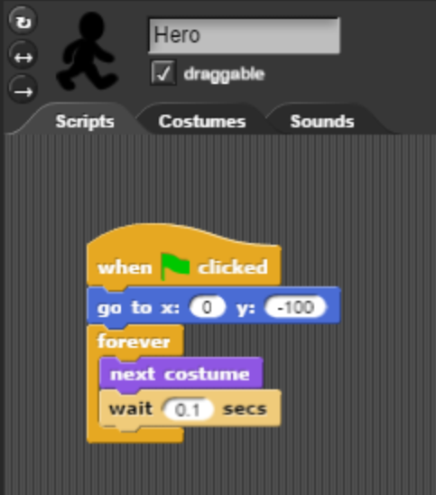

# How to Build a Platform Game in Snap

By Larry K

## Animating a Character

A character should have multiple costumes representing each frame. Right click on each of the images below and save them to your desktop. 

Drag these images to the costumes tab for your sprite in Snap. Rename your main Sprite to "Hero". This will make it clear that this Sprite represents the main character in your platform game. When you are done, your Costumes tab should look like the one below:

## Adding a Background

## Moving Left and Right

## Gravity

