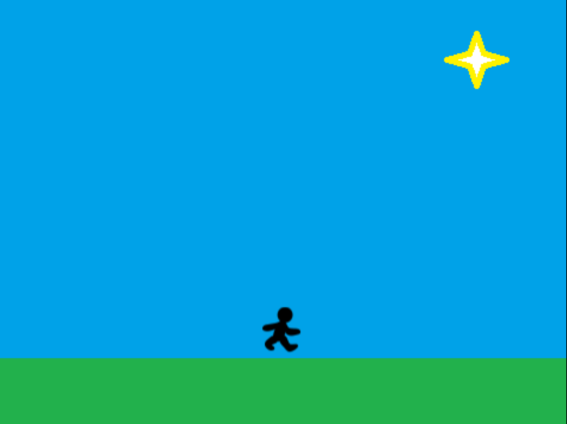

# How to Build a Platform Game in Snap

By Larry K

## What is a Platform Game?

A platform game  consists of a player-controlled **Hero** who completes a series of **levels** or **missions** by defeating **enemies**, avoiding **hazards**, and collecting **powerups**. Each level has an **objective** or **goal** that must be achieved in order to complete the level. It is called a platform game because the player jumps on **platforms** to dodge various enemies and hazards. Platform games typically have a number of **powerups** that make the Hero more powerful. 

One of the most famous platform games is Super Mario Brothers. In Mario Brothers, the Heroes are Mario and Luigi. Mario completes a level by touching the flag or defeating Bowser. Enemies in Mario Brothers include Goombas, Koopa Troopas, and Thwomps, who each attack Mario in various ways. Mario collects various **powerups** to get special abilities. Examples of powerups in Mario Brothers include Mushrooms (make Mario stronger), Stars (make Mario invincible), and Flower Power (gives Mario the ability to shoot fire).

Other examples of platform games include Sonic the Hedgehog, Metroid, and many others. In Metroid, the hero is Samus Aran. Examples of powerups in Metroid include the Ice Beam (freezes enemies), High Jump Boots (make Samus jump higher), and Missile Packs (more powerful attacks). 

In this project, you will design your own unique platform game, including the Hero, multiple powerups, levels, and hazards.

## The Hero

We will start off our platform game by creating a Hero sprite. The Hero is controlled by the person playing the game using the arrow keys. The first task is to create costumes to control how our Hero Sprite will look.

### Animating a Character With Costumes

We can animate a character by repeatedly changing its costume. For instance, we could use the "next costume" block in a forever loop, waiting 0.1 seconds between each costume change. To try this out, let's use some simple stick figure costumes. Right click on each of the images below and save them to your desktop. 

Drag these images to the costumes tab for your sprite in Snap. Rename your main Sprite to "Hero". This will make it clear that this Sprite represents the main character in your platform game. When you are done, your Costumes tab should look like the one below:

After you have added your costumes, click on the Scripts tab to add the code to change costumes every tenth of a second as shown below. When you run your program, your hero should look like it is walking in place.

## Creating a Level 

Our Hero is now animated, but the stage still has the default white background costume. Since our platform game will have multiple levels or stages, we will want to design multiple costumes for the stage that represent each level. Let's start by saving the image below to the desktop:

Once the image is saved, switch to the Stage Sprite in Snap and click on the Costumes tab. Drag the stage image to the costumes tab to change the background. You will create a background for each level or stage in the game. When the player completes the objective for each level, you can broadcast a "level completed" message and change the costume of the stage to the next level's background.

When you are done adding your background to the stage, your screen should now look like the one below. When you click the flag to start the game, your Hero should be walking in place just above the ground.

## Moving Left and Right

Now we want to move our Hero left and right when the player presses the left and right arrow keys on their keyboard. To do this, we will use the "key pressed" block under "Sensing". In our game loop (the forever block), we will check if the left or right arrow key is pressed. If the left arrow key is pressed, we will point the Hero left (-90) and change the Hero's **x position** by a negative value. If the right arrow key is pressed, we will point the Hero right (90) and change the Hero's **x position** by a positive number. Let's create a variable called **xchange** that will store the amount to change the character's **x position** by. The arrow presses will modify this value and we will update the Sprite's position each time the loop runs. Modify your script to look like the one below and test this out:

You will notice that your Hero will rapidly move in the direction of the arrow pressed. To make our character's movement more realistic, we will simulate some friction and gradually slow the Sprite's speed down to zero. To do this, multiply the **xchange** variable we create by a number less than 1 as shown below. This will make the **xchange** value go down from 1 to 0 gradually. Add the change below and run your program.

## Jumping and Gravity

Now that our character can move left and right, we want our character to be able to jump using the **up** arrow. So we will add another block to check if the **up arrow key** is pressed. If so, we will change the Hero's **y position**. When the up arrow is initially pressed, we will **change the y position by a positive number** so that the character rises. However, we want the player to obey the laws of gravity, so we will then gradually **decrease the Sprite's y position** until the Hero touches the ground. Create a variable called **ychange** as shown below. This variable will keep track of updates to the Hero's **y position**:

Notice that we tell our Sprite to stop falling when it hits the ground by repeating until it is **touching the color of the ground**. To choose the correct **touching** color, bring up the color chooser and click on the ground on the stage. This will let us pick the exact color of the ground so that our loop knows when to stop. 

Once you have completed your script, test your program out. You should have a character that can move around and jump. Once you have your program working, begin thinking about how you will add Sprites for powerups, platforms, and enemies. Plan out what each of these Sprites will look like and how they will affect the Hero. Sketch out your levels / stages and think about an objective for each of them. Ask questions and discuss your game with others if you need help coming up with ideas. 
